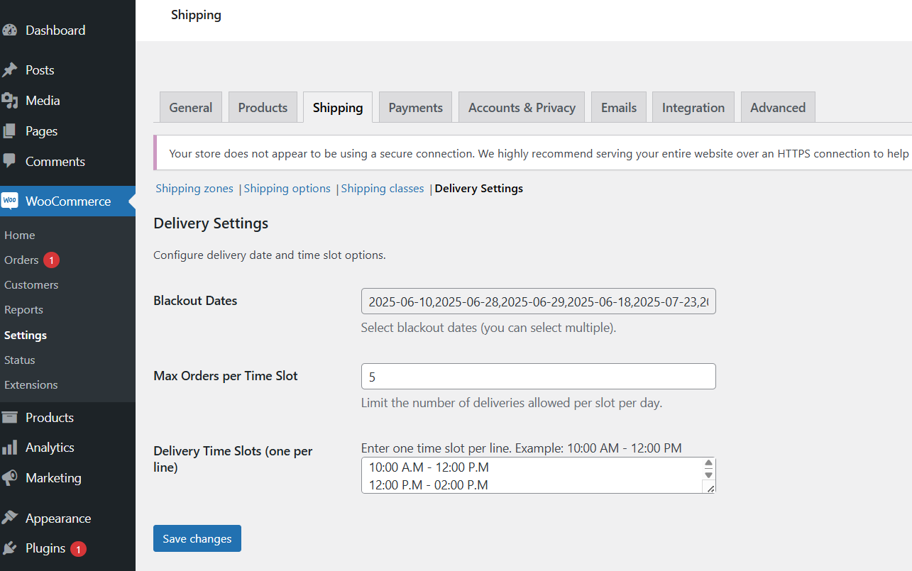

# Delivery Date & Time Slot Picker for WooCommerce

Let your customers select a delivery date and time slot during WooCommerce checkout. Perfect for local delivery services like bakeries, grocery stores, or flower shops.

## 🔥 Features

- Delivery Date Picker at checkout
- Admin-configurable Delivery Time Slots
- Limit orders per time slot
- Blackout Dates via calendar (multi-select)
- WooCommerce shipping method compatibility

## 📸 Screenshots

| Checkout View | Admin Settings |
|---------------|----------------|
|  |  |

## 📥 Installation

1. Upload the plugin to your WordPress `/wp-content/plugins/` directory.
2. Activate it via the **Plugins** menu.
3. Go to **WooCommerce > Settings > Shipping > Delivery Settings** to configure.

## 🌍 Translations

This plugin is translation-ready. `.pot` file is located in `/languages/`.

## 📜 License

Licensed under [GPLv2 or later](https://www.gnu.org/licenses/gpl-2.0.html).

---

## 🤝 Contribute

Feel free to submit PRs or report issues!