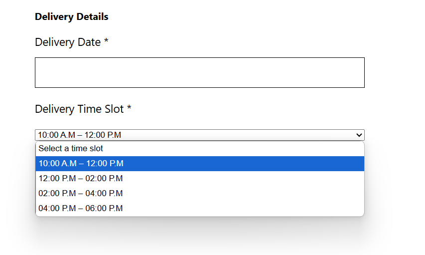
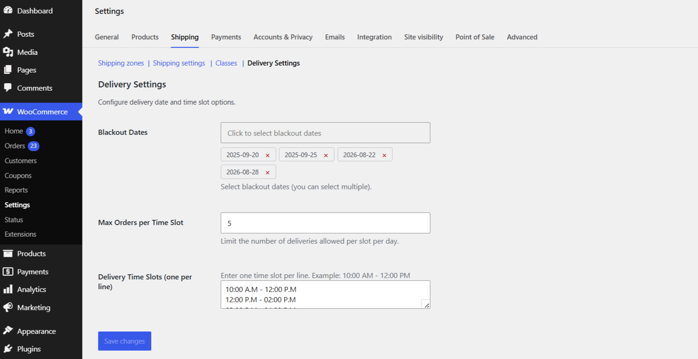

# Delivery Date & Time Slot Picker for WooCommerce

Let your customers select a delivery date and time slot during WooCommerce checkout. Perfect for local delivery services like bakeries, grocery stores, or flower shops.

## 🔥 Features

- Delivery Date Picker at checkout (Classic and Blocks checkout)
- Admin-configurable Delivery Time Slots, validated server-side
- Limit orders per time slot (enforced at checkout)
- Blackout Dates via calendar (multi-select, shown as removable tags)
- HPOS and Cart & Checkout Blocks compatible
- WooCommerce shipping method compatibility
- Delivery details shown on the admin order screen, thank-you page and My Account
- Quick "Settings" link on the Plugins screen
- Delivery Date column on the Orders list
- Consistent "Delivery Details" card on order confirmation (Classic and Blocks)

## ✅ Requirements

- WordPress 6.0+ (tested up to 7.1)
- WooCommerce (tested with 11.1)
- PHP 7.4+

## 📸 Screenshots

| Checkout View | Admin Settings |
|---------------|----------------|
|  |  |

## 📥 Installation

1. Upload the plugin to your WordPress `/wp-content/plugins/` directory.
2. Activate it via the **Plugins** menu.
3. Go to **WooCommerce > Settings > Shipping > Delivery Settings** to configure.

## 🌍 Translations

This plugin is translation-ready. `.pot` file is located in `/languages/`.

## 📝 Changelog

### 1.7
- Added a Delivery Date column (with time slot) to the WooCommerce Orders list, HPOS and legacy storage
- Unified card-style Delivery Details table on order-received, order-details and My Account pages
- Blocks order confirmation heading now reads "Delivery Details" instead of "Additional information"
- Added `delivery-order-details.css`, loaded only on order pages

See `readme.txt` for the full history.

## 📜 License

Licensed under [GPLv2 or later](https://www.gnu.org/licenses/gpl-2.0.html).

---

## 🤝 Contribute

Feel free to submit PRs or report issues!